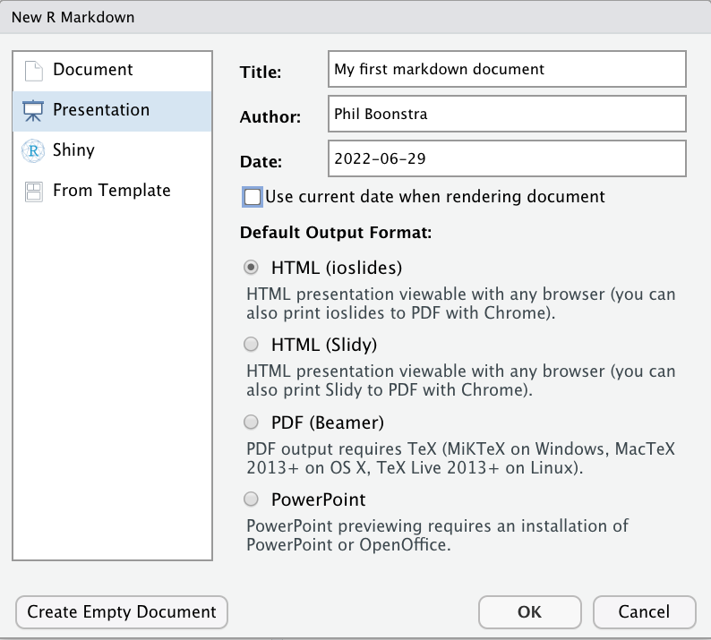
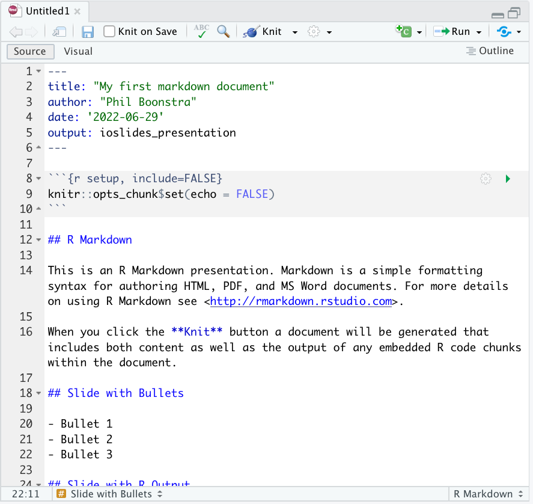
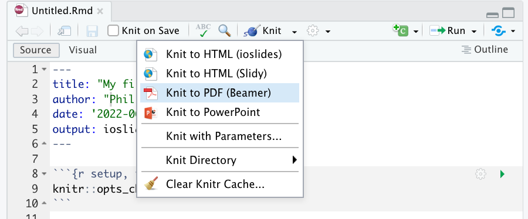

```{r setup, include=FALSE}
library(tidyverse); 
library(knitr);
library(countdown);
knitr::opts_chunk$set(echo = F, warning = F, message = F, cache = F);
knitr::knit_hooks$set(mysize = function(before, options, envir) {
  if (before) 
    return(options$size);
})

options(digits = 5);
theme_set(theme_bw())
image_scaler = 1;#set to 0.6 for pdf_document, 1 for ioslides_presentation
```


##

<iframe src="https://player.vimeo.com/video/178485416" width="640px" height="400px"></iframe>

# The basics 

## When to use

- Reports

- Slides

- Manuscripts / books

## Why to use

- `R` code and interpretations integrated into a single document

- Separate tasks of *reporting* the results from *formatting* the results:

    * decreases risk of copy-paste errors
  
    * decreases workload
  
- Quickly create the same document in different formats, e.g. slides to show and handouts for the audience

- Create websites

##

```{r, out.width = paste0(image_scaler*850,"px")}
knitr::include_graphics("images/markdown_flow.png");
```

source: [rstudio.com](https://rmarkdown.rstudio.com/lesson-2.html)

##

```{r, out.width = paste0(image_scaler*850,"px")}

```

whatever format you want to create: html, pdf, docx, ...

##

```{r, out.width = paste0(image_scaler*850,"px")}
knitr::include_graphics("images/markdown_flow5.png")
```

`pandoc`: "an open-source document converter" ([wikipedia](https://en.wikipedia.org/wiki/Pandoc)). Translates markup from one type of format, e.g. markdown, to another

##

```{r, out.width = paste0(image_scaler*850,"px")}
knitr::include_graphics("images/markdown_flow4.png")
```

`md`: a document written in markdown, "a lightweight markup language with plain text formatting syntax" ([wikipedia](https://en.wikipedia.org/wiki/Markdown)). Github also uses markdown. 

##

```{r, out.width = paste0(image_scaler*850,"px")}
knitr::include_graphics("images/markdown_flow3.png")
```


`knitr`: an [`R` package](https://yihui.name/knitr/) for creating reports directly in R. Will translate your R markdown document (`.Rmd`), including embedded `R` code, to a plain markdown document

##

```{r, out.width = paste0(image_scaler*850,"px")}
knitr::include_graphics("images/markdown_flow2.png")
```

`.Rmd`: file type recognized by Rstudio. This is where everything goes: your header, `R` code chunks, and your content written in markdown 


##

From RStudio, go to  `File` > `New File` > `R Markdown...`

```{r, out.width = paste0(image_scaler*700,"px")}
knitr::include_graphics("images/new_rmarkdown0.png")
```

## Choose your document type

```{r, out.width = paste0(image_scaler*700,"px")}

```

## Get a template

```{r, out.width = paste0(image_scaler*800,"px")}

```

## "YAML" Header

```{r, out.width = paste0(image_scaler*800,"px")}
knitr::include_graphics("images/new_rmarkdown3.png")
```


## Write R code in chunks

```{r, out.width = paste0(image_scaler*800,"px")}
knitr::include_graphics("images/new_rmarkdown4.png")
```


## Write plain text

```{r, out.width = paste0(image_scaler*800,"px")}

```


## Knit your document to see the final product

```{r, out.width = paste0(image_scaler*800,"px")}
knitr::include_graphics("images/new_rmarkdown6.png")
```


## 

```{r, out.width = paste0(image_scaler*400,"px")}

```


## Try it out: Option 1

  a. Download `R` (https://cran.r-project.org/)
  b. Download `R`Studio to interface with `R` (https://www.rstudio.com/)
  c. Go to https://github.com/psboonstra/markdown-workshop, then 'Code', then 'Download ZIP'
  
```{r, out.width = paste0(image_scaler*400,"px")}

```

  d. Unzip the folder, then open the .RProj file
  e. In RStudio, click on 'Files' at the bottom, and pull up `01-exercise.Rmd`
  
  
## Try it out: Option 2 

  a. Go to https://rstudio.cloud/ > Get Started
  b. Create an account
  c. Click the dropdown menu *next to* the New Project button, and enter the workshop URL of the workshop repository: https://github.com/psboonstra/markdown-workshop
  d. Click on 'Files' at the bottom, and pull up `01-exercise.Rmd`
  
## Your turn

<iframe src="https://embed.polleverywhere.com/multiple_choice_polls/44rtjItY4NgC2bOK0DpOq?controls=presentation&amp;force=--+none+--&amp;push=manual" width="40%" height="15%" frameBorder="0"></iframe> 


```{r, cache = FALSE, echo = FALSE}
countdown(minutes = 8, seconds = 0)
``` 

## Takeaways

- Chunk options control how the chunk is evaluated and used
- You can knit the same document to different formats (sometimes easy to do, sometimes requires a bit of finagling)
- Consider using in-line chunks instead of hard-coding results

## Use Markdown to tell your story

If you name a variable in an earlier code chunk, you can use it again in a later chunk. 

## early code chunk

```{r, echo = TRUE}
x <- rnorm(20);
y <- 3 * x + rnorm(length(x));
foo = tibble(x = x, y = y);
```

## later code chunk

```{r, echo = TRUE, fig.height = 4, fig.width = 4}
library(ggplot2)
ggplot(data = foo) + 
  geom_point(aes(x, y));
```

## Tables

```{r, echo = TRUE}
foo;
```

## Tables using 'kable'

```{r}
kable(foo);
```


## Other Markdown basics

* Use #, ##, ###, etc to indicate deeper layers of a header

* Use *, + for bulleted (unordered) lists

* Use (i), (a), or 1. for ordered lists

* Use \*{text}\* for *italics*, \*\*{text}\*\* for **bold**


# Random lessons I've learned

## Markdown can be really, really finicky about horizontal and vertical spacing

If something (a new header option, a code chunk, etc) is not working as you expect, 
try adding an additional linebreak

If experimenting with a new feature, re-knit frequently

## Caching

If, like me, you become a compulsive re-knitter, the code chunk option 
`cache = TRUE` is both useful and dangerous. 

` ```{r, cache = TRUE} `

` (some intensive task)`

` ``` `

As long as you don't change *anything* in the chunk, you won't need to re-run the intensive task upon re-knitting. However, things can go awry...

## 

- Open the file `caching_mishap.Rmd` and make sure you understand the intended behavior
(should be trivial!)

- Knit the document

- Now edit your first chunk, changing to `x <- rnorm(n = 1, mean = 100)`
and leaving the second chunk alone

- Re-knit your document

##

That's how we get results like this:

```{r, echo = TRUE, cache = TRUE}
x <- rnorm(n = 1, mean = 100);
```

```{r, echo = FALSE, include = TRUE, cache = TRUE}
x <- rnorm(n = 1, mean = 0);
```

```{r, echo = TRUE, cache = TRUE}
x;
```

## 

### What happened

We triggered a recache of the first chunk without triggering a reache of the second

### Possible solutions

- Cache with caution and only cache costly chunks

- Think about when and where you want to split your chunk

- For chunks that may be susceptible, trigger a re-cache by adding a comment character (`#`) at the end of a line, or making some other innocuous change to your chunk. Even extra white space will trigger a re-cache

- Go to Knit > Clear Knitr Cache... or delete directly the folder ending in `[filename]_cache` in your working directory

## `knitr` can run code in other languages

Including 

  * Python
    
  * SQL
    
  * Julia 
    
  * Stan
    
  * Javascript
    
Use ` ```{python} ` to start a python code chunk, ` ```{julia} ` to start a julia code chunk, ` ```{bash} ` to start a Shell script, etc. 

You may need external language engines to successfully call other languages. I have not used this functionality before.

see [Chapter 2.7, R Markdown: The Definitive Guide](https://bookdown.org/yihui/rmarkdown/language-engines.html)

# More practice

## You can knit `R` scripts!

You are not limited to using Markdown in `Rmd` files -- you can knit `R` scripts 
using the same shortcut: *Cmd+Shift+K* / *Ctrl+Shift+K*

  - Use `#'` to indicate a switch to markdown 
  
  - Use `#+` to start a new chunk


## Your turn again

Open `02-exercise.R` and complete the tasks. Indicate when you are done. 

<iframe src="https://embed.polleverywhere.com/multiple_choice_polls/HmPk5eNECOaBmj7drngrh?controls=presentation&amp;force=--+none+--&amp;push=manual" width="40%" height="15%" frameBorder="0"></iframe> 


```{r, cache = FALSE, echo = FALSE}
countdown(minutes = 8, seconds = 0)
``` 

# Data analyses in `R`

## `readr` package

Part of the `tidyverse` (along with `dplyr` and `ggplot2`):

```{r, out.width = paste0(image_scaler*500,"px")}
knitr::include_graphics("images/tidyverse.png")
```

https://www.tidyverse.org/

## 

`readr` gives you tools to read in data from files outside `R`, wrangled and manipulated, and then written to files outside `R`:

```{r, out.width = paste0(image_scaler*1e3,"px")}
knitr::include_graphics("images/readr_context.png")
```

##

The workhorse of the `readr` package is `read_csv`, which reads a comma-separated value (`csv`) file into `R` as a `data.frame` 
From the help page:

```
read_csv(file, col_names = TRUE, col_types = NULL, locale = default_locale(), 
na = c("", "NA"), quoted_na = TRUE, quote = "\"", comment = "", trim_ws = TRUE, 
skip = 0, n_max = Inf, guess_max = min(1000, n_max), progress = show_progress(), 
skip_empty_rows = TRUE)
```

Typical use is `my_data <- read_csv("my_files_path.csv")`

## Mouse xenograft study

  - $n=37$ mice implanted with human tumor
  - Randomized to one of three treatment groups (radiation only; drug only; or both drug and radiation) or no treatment
  - Each tumor on each mouse measured daily for up to 4 weeks
  - Available at American Statistical Association’s Section on Teaching of Statistics in the Health Sciences (TSHS) [data portal](https://www.causeweb.org/tshs/tumor-growth/)
  - File is called `tumor_growth.csv`


Varna M, Bertheau P, Legres LG. Tumor Microenvironment in Human Tumor Xenografted Mouse Models. Journal of Analytical Oncology 2014; 3(3): 159-166.

## 

```{r, echo = T}
(tumor_growth <- read_csv("tumor_growth.csv"))
```

## Digression: testing your `dplyr` knowledge

```{r, echo = T, eval = F}
tumor_growth %>% 
  filter(Day %in% c(0, 14)) %>%
  group_by(Grp, Day) %>%
  summarize(mean_Size = mean(Size))
```

<iframe src="https://embed.polleverywhere.com/multiple_choice_polls/44zAaR3X8gQIlQ6M1D0hC?controls=presentation&amp;force=--+none+--&amp;push=manual" width="100%" height="80%" frameBorder="0"></iframe> 


## Digression: testing your `dplyr` knowledge

```{r, echo = T, eval = F}
tumor_growth %>% 
  filter(Day %in% c(0, 7, 14)) %>%
  group_by(Grp, Day) %>%
  summarize(mean_Size = mean(Size),
            sd_Size = sd(Size))
```

<iframe src="https://embed.polleverywhere.com/multiple_choice_polls/OlS2sh07hAa5a9MNQfalE?controls=presentation&amp;force=--+none+--&amp;push=manual" width="100%" height="80%" frameBorder="0"></iframe> 


## Digression: testing your `dplyr` knowledge

```{r, echo = T, eval = F}
tumor_growth %>% 
  filter(Grp == "1.CTR") %>%
  group_by(ID) %>% 
  summarize(n = n()) %>% 
  summarize(n = mean(n)) %>% 
  pull(n) # pull
```

<iframe src="https://embed.polleverywhere.com/multiple_choice_polls/lHzckr7Figsg47EdJjoOO?controls=presentation&amp;force=--+none+--&amp;push=manual" width="100%" height="80%" frameBorder="0"></iframe> 


##  What to do next


<iframe src="https://rmarkdown.rstudio.com/" width="640px" height="400px"></iframe>

<p> https://rmarkdown.rstudio.com/</p>


##

[R Markdown: The definitive guide](https://bookdown.org/yihui/rmarkdown/)

  - Free, online version of a book written by the `R`studio experts

[R Markdown cheatsheet](https://www.rstudio.com/resources/cheatsheets/#rmarkdown)

  - Helpful quick reference

[Mastering markdown](https://guides.github.com/features/mastering-markdown/)

  - Reference site for markdown 
  
## References


\footnotesize