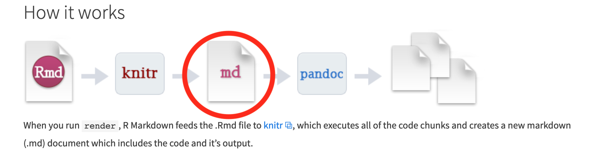
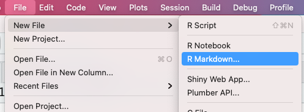
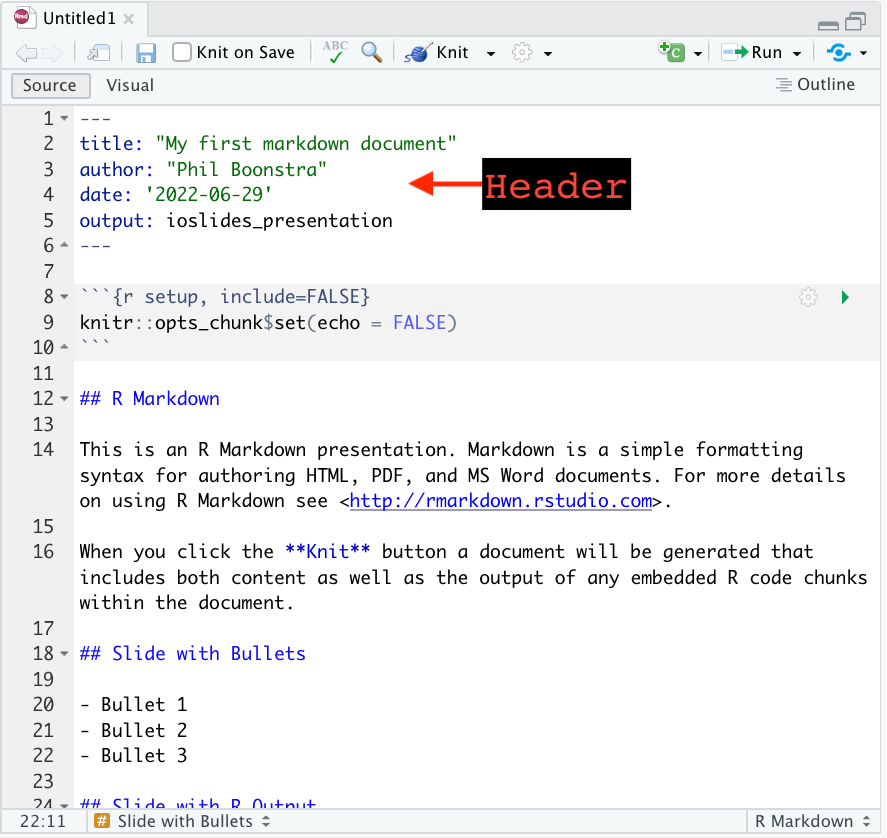
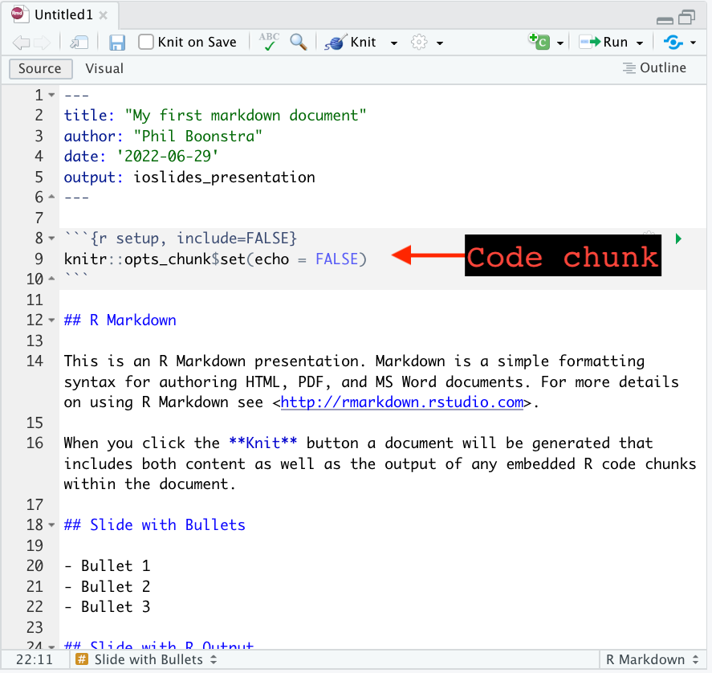
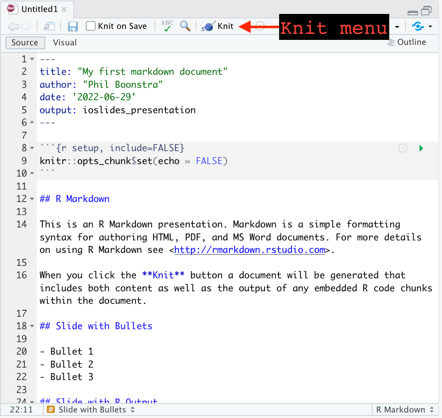
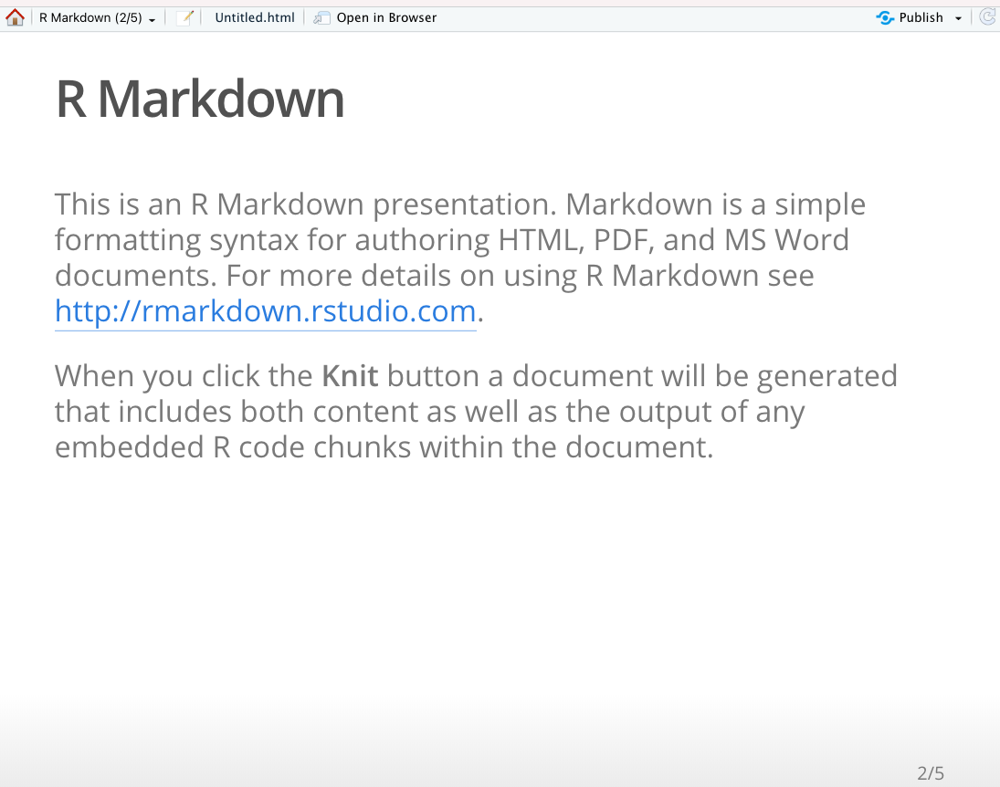
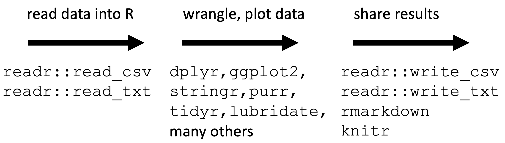

```{r setup, include=FALSE}
library(tidyverse) 
library(knitr)
library(countdown)
knitr::opts_chunk$set(echo = T, warning = F, message = F, cache = F)
knitr::knit_hooks$set(mysize = function(before, options, envir) {
  if (before) 
    return(options$size)
})

options(digits = 5)
theme_set(theme_bw())
image_scaler = 1#set to 0.6 for pdf_document, 1 for ioslides_presentation
```

## About me

- Associate Professor in Biostatistics
- Former PhD student at Michigan Biostatistics
- R user and aficionado


##

<iframe src="https://player.vimeo.com/video/178485416" width="640px" height="400px"></iframe>

# The basics 

## When to use

- Reports

- Slides

- Manuscripts / books

- Simple websites

## Why to use

- R code and interpretations integrated into a single document

- Separates task of *reporting* the results from *formatting* the results:

    * decreases risk of copy-paste errors
  
    * decreases workload
  
- Quickly create the same document in different formats, e.g. slides to show 
and handouts for the audience

##

```{r, out.width = paste0(image_scaler*850,"px"), echo = F}

```

source: [rstudio.com](https://rmarkdown.rstudio.com/lesson-2.html)


##

```{r, out.width = paste0(image_scaler*850,"px"), echo = F}
include_graphics("images/markdown_flow6.png")
```

whatever format you want to create: html, pdf, docx, ...

image source: [rstudio.com](https://rmarkdown.rstudio.com/lesson-2.html)

##

```{r, out.width = paste0(image_scaler*850,"px"), echo = F}

```

`pandoc`: "an open-source document converter" ([wikipedia](https://en.wikipedia.org/wiki/Pandoc)). Translates markup from one type of format, e.g. markdown, to another

image source: [rstudio.com](https://rmarkdown.rstudio.com/lesson-2.html)

##

```{r, out.width = paste0(image_scaler*850,"px"), echo = F}

```

`md`: a document written in markdown, "a lightweight markup language with plain text formatting syntax" ([wikipedia](https://en.wikipedia.org/wiki/Markdown)). Github also uses markdown. 

image source: [rstudio.com](https://rmarkdown.rstudio.com/lesson-2.html)

##

```{r, out.width = paste0(image_scaler*850,"px"), echo = F}

```

`knitr`: an [R package](https://yihui.name/knitr/) for creating reports directly in R. Will translate your R markdown document (Rmd), including embedded R code, to a plain markdown document

image source: [rstudio.com](https://rmarkdown.rstudio.com/lesson-2.html)

##

```{r, out.width = paste0(image_scaler*850,"px"), echo = F}

```

Rmd: file type recognized by RStudio. This is where everything goes: your header, R code chunks, and your content written in markdown 

image source: [rstudio.com](https://rmarkdown.rstudio.com/lesson-2.html)

##

From RStudio, go to  `File` > `New File` > `R Markdown...`

```{r, out.width = paste0(image_scaler*700,"px"), echo = F}

```

## Choose your document type

```{r, out.width = paste0(image_scaler*700,"px"), echo = F}
include_graphics("images/new_rmarkdown1.png")
```

## Get a template

```{r, out.width = paste0(image_scaler*800,"px"), echo = F}
include_graphics("images/new_rmarkdown2.png")
```

## "YAML" Header

```{r, out.width = paste0(image_scaler*800,"px"), echo = F}

```


## Write R code in chunks

```{r, out.width = paste0(image_scaler*800,"px"), echo = F}

```


## Write plain text

```{r, out.width = paste0(image_scaler*800,"px"), echo = F}
include_graphics("images/new_rmarkdown5.png")
```


## Knit your document to see the final product

```{r, out.width = paste0(image_scaler*800,"px"), echo = F}

```

## Knit your document to see the final product

```{r, out.width = paste0(image_scaler*700,"px"), echo = F}

```


## 

```{r, out.width = paste0(image_scaler*900,"px"), echo = F}
include_graphics("images/knit_menu.png")
```

## 

This is what my code chunk looks like for the previous slide:

````r
```{r, out.width = paste0(image_scaler*400,"px"), echo = F}`r ''`
include_graphics("images/knit_menu.png")
```
````

## Try it out: Option 1

  a. Download R (https://cran.r-project.org/)
  b. Download RStudio to interface with R (https://posit.co/)
  c. Go to https://github.com/psboonstra/markdown-workshop, then 'Code', then 'Download ZIP'
  
```{r, out.width = paste0(image_scaler*400,"px"), echo = F}
include_graphics("images/git_download.png")
```

  d. Unzip the folder, then open the `.RProj` file
  e. In RStudio, click on 'Files' at the bottom, and pull up `01-exercise.Rmd`
  
  
## Try it out: Option 2 

  a. Go to https://posit.cloud/ > Get Started
  b. Create an account
  c. Click the dropdown menu *next to* the New Project button, and enter the workshop URL of the workshop repository: https://github.com/psboonstra/markdown-workshop
  d. Click on 'Files' at the bottom, and pull up `01-exercise.Rmd`
  
## Your turn

Complete the tasks in `01-exercise.Rmd`. 

```{r, cache = FALSE, echo = FALSE}
countdown(minutes = 8, seconds = 0)
``` 

## Takeaways

- Markdown tries to focus on simplicity
- Chunk options control how the chunk is evaluated and used
- You can knit the same document to different formats (sometimes easy to do, sometimes requires a bit of finagling)
- Consider using in-line chunks instead of hard-coding results

# Use Markdown to tell your story


## Early code chunk

If you name a variable in an earlier code chunk, you can refer to it again in a later chunk. 

```{r, echo = TRUE}
x <- rnorm(20)
y <- 3 * x + rnorm(length(x))
foo = tibble(x = x, y = y)
```

## Later code chunk

```{r, echo = TRUE, fig.height = 4, fig.width = 4}
library(ggplot2)
ggplot(data = foo) + 
  geom_point(aes(x, y))
```

## Tables

```{r, echo = TRUE}
foo
```

## Tables using 'kable'

```{r}
kable(foo)
```

# Random lessons I've learned

## Markdown can be really, really finicky about horizontal and vertical spacing

If something (a new header option, a code chunk, etc) is not working as you expect, 
try adding an additional linebreak

If experimenting with a new feature, re-knit frequently

## Caching

If, like me, you become a compulsive re-knitter, the code chunk option 
`cache = TRUE` is both useful and dangerous. 


````markdown

```{r, cache = TRUE}`r ''`
# some intensive task
```
````

As long as you don't change *anything* in the chunk, you won't need to re-run the intensive task upon re-knitting. However, things can go awry...

## 

- Open the file `caching_mishap.Rmd` and make sure you understand the intended behavior
(should be trivial!)

- Knit the document

- Now edit your first chunk, changing to `x <- rnorm(n = 1, mean = 0)`
and leaving the second chunk alone

- Re-knit your document

##

That's how we get results like this:

```{r, echo = TRUE, cache = TRUE}
x <- rnorm(n = 1, mean = 0)
```

```{r, echo = FALSE, include = TRUE, cache = TRUE}
x <- rnorm(n = 1, mean = 100)
```

```{r, echo = TRUE, cache = TRUE}
x
```

## 

### What happened

We invalidated the cache in the first chunk (triggering it to run again) without
invalidating the cache in the second chunk (so it was left alone)

### Possible solutions

- Consider if the chunks should be combined

- You can invalidate a cache by adding a comment character (`#`) at the end of 
a line, or making some other innocuous change to your chunk. Even extra white 
space will invalidate the cache

- Go to `Knit` > `Clear Knitr Cache...` or delete directly the folder ending 
in `[filename]_cache` in your working directory

## 

<blockquote class="twitter-tweet" data-theme="dark"><p lang="en" dir="ltr"><a href="https://twitter.com/hashtag/RMarkdown?src=hash&amp;ref_src=twsrc%5Etfw">#RMarkdown</a> question: If I cache the chunk that loads the R packages, then I sometimes (not always) get random errors from downstream chunks that can&#39;t find a loaded function, as if it wasn&#39;t loaded. Un-cache-ing the chunk seems to fix the problem. Anyone else encounter this?</p>&mdash; Philip Boonstra (@psboonstra) <a href="https://twitter.com/psboonstra/status/1359145618854338567?ref_src=twsrc%5Etfw">February 9, 2021</a></blockquote> <script async src="https://platform.twitter.com/widgets.js" charset="utf-8"></script> 

##

<blockquote class="twitter-tweet" data-conversation="none" data-lang="en" data-theme="dark"><p lang="en" dir="ltr">The cache mechanism is not to be used with code chunk that have side effect used by other chunks - loading package that are used by other chunk is one of this. See more in :<a href="https://t.co/bpKPzkFMad">https://t.co/bpKPzkFMad</a><br>If you activate cache globally you need to se cache=FALSE</p>&mdash; Christophe Dervieux (@chrisderv) <a href="https://twitter.com/chrisderv/status/1359516129560064001?ref_src=twsrc%5Etfw">February 10, 2021</a></blockquote> <script async src="https://platform.twitter.com/widgets.js" charset="utf-8"></script> 

## 


> The most appropriate use case of caching is to save and reload R objects 
> that take too long to compute in a code chunk, and the code does not have 
> any side effects, such as changing global R options via options() (such 
> changes will not be cached). If a code chunk has side effects, we recommend 
> that you do not cache it.

[Section 11.4, RMarkdown Cookbook](https://bookdown.org/yihui/rmarkdown-cookbook/cache.html)


## `knitr` can run code in other languages

Including 

  * Python
    
  * SQL
    
  * Julia 
    
  * Stan
    
  * Javascript
    
Use ` ```{python} ` to start a python code chunk, ` ```{julia} ` to start a julia code chunk, ` ```{bash} ` to start a Shell script, etc. 

You may need external language engines to successfully call other languages. I have not used this functionality before.

see [Chapter 2.7, R Markdown: The Definitive Guide](https://bookdown.org/yihui/rmarkdown/language-engines.html)


# More practice

## You can knit R scripts!

You are not limited to using Markdown in Rmd files -- you can knit R scripts 
using the same shortcut: *Cmd+Shift+K* / *Ctrl+Shift+K*

  - Use `#'` to indicate a switch to markdown 
  
  - Use `#+` to start a new chunk


## Your turn again

Open `02-exercise.R` and complete the tasks. 

```{r, cache = FALSE, echo = FALSE}
countdown(minutes = 8, seconds = 0)
``` 

## Embedding html tags into your markdown

````
<iframe src="https://isitchristmas.com/"></iframe> 
````

yields

<iframe src="https://isitchristmas.com/"></iframe> 


# Data analyses in R

## `readr` package

Part of the `tidyverse` (along with `dplyr` and `ggplot2`):

```{r, out.width = paste0(image_scaler*500,"px"), echo = F}

```

https://www.tidyverse.org/

## 

`readr` gives you tools to read in data from files outside R, wrangled and manipulated, and then written to files outside R:

```{r, out.width = paste0(image_scaler*1e3,"px"), echo = F}

```

##

The workhorse of the `readr` package is `read_csv`, which reads a comma-separated value (`csv`) file into R as a `data.frame` 
From the help page:

```
read_csv(file, col_names = TRUE, col_types = NULL, locale = default_locale(), 
na = c("", "NA"), quoted_na = TRUE, quote = "\"", comment = "", trim_ws = TRUE, 
skip = 0, n_max = Inf, guess_max = min(1000, n_max), progress = show_progress(), 
skip_empty_rows = TRUE)
```

Typical use is `my_data <- read_csv("my_files_path.csv")`

## Digression: How does `read_csv` know where to look?

Get your current working directory in R:

```{r}
getwd()
```

How did R know this was my desired working directory? Why did I not need to do this:

```{r, eval = FALSE}
setwd("/Users/philb/Desktop/Work/BDSI2023/markdown-workshop")
```


## R Projects and working directories

Your working directory is automatically set when you work inside an R project.

```{r, out.width = paste0(image_scaler*500,"px"), echo = F}

```

##

###

To *create* an R project, go to `File` > `New Project...` > `Existing Directory`
and choose your folder

### 

To *open* an existing R project, find the `.Rproj` file or go to `File` > 
`Open Project...`


## Mouse xenograft study

  - $n=37$ mice implanted with human tumor
  - Randomized to one of three treatment groups (radiation only; drug only; or both drug and radiation) or no treatment
  - Each tumor on each mouse measured daily for up to 4 weeks
  - Available at American Statistical Association’s Section on Teaching of Statistics in the Health Sciences (TSHS) [data portal](https://www.causeweb.org/tshs/tumor-growth/)
  - File is called `tumor_growth.csv`

@varna2014tumor

## 

```{r, echo = T}
(tumor_growth <- read_csv("tumor_growth.csv"))
```

## One more time

Open `03-exercise.Rmd` and complete the tasks. 


```{r, cache = FALSE, echo = FALSE}
countdown(minutes = 15, seconds = 0)
``` 


##  What to do next


<iframe src="https://rmarkdown.rstudio.com/" width="640px" height="400px"></iframe>

<p> https://rmarkdown.rstudio.com/</p>


##

[R Markdown on RStudio.com](https://rmarkdown.rstudio.com/index.html)

[R Markdown: The definitive guide](https://bookdown.org/yihui/rmarkdown/)

  - Free, online version of a book written by the RStudio experts

[R Markdown cheatsheet](https://raw.githubusercontent.com/rstudio/cheatsheets/master/rmarkdown-2.0.pdf)

  - Helpful quick reference

[Mastering markdown](https://guides.github.com/features/mastering-markdown/)

  - Reference site for markdown langauge 
  
[Project-oriented workflow](https://www.tidyverse.org/blog/2017/12/workflow-vs-script/)

  - The benefits of working in self-contained projects
  
## References


\footnotesize